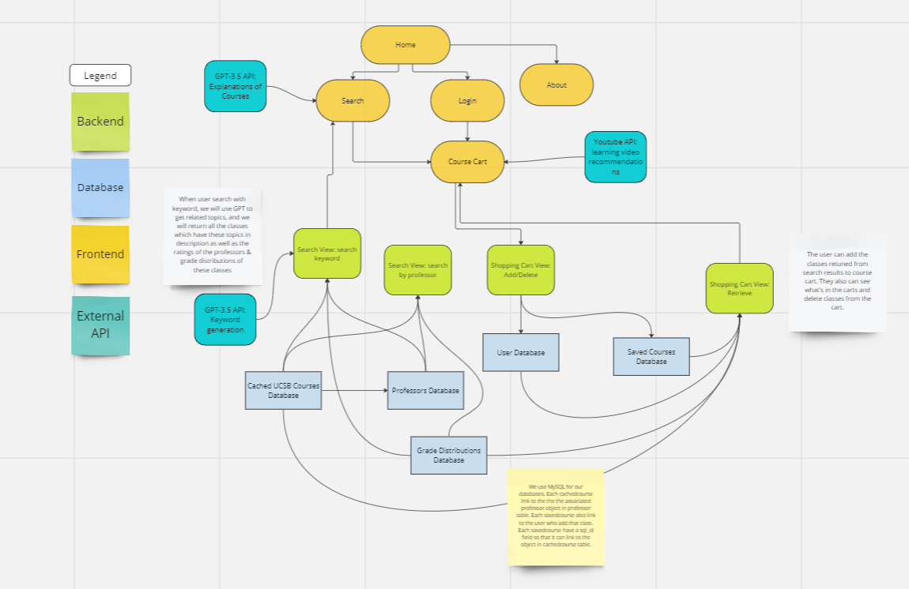

# DESIGN

1. **Opening/Overview section**
    1. **Frontend**: The frontend illustrates the whole web and intends to satisfy the user's needs and improve their experience with the course system using React. In the frontend, the search and course cart are two main portions that let users check the course result and select their own plan. The login feature makes sure each user’s plan history can be stored and retrieved. OpenAI and YouTube API are used to achieve recommendations.

    2. **Backend**: The backend stores all related information that the frontend server doesn’t handle, which can include course information, saved courses in the shopping cart, and other forms of data. The backend is hosted as a separate web host with a unique URL that the frontend server can communicate with. When the frontend requires data, the frontend sends GET requests to the backend, and when the frontend wants to store information, it uses POST requests. The backend stores its data using MySQL. Each form of data is represented by a model, and that model is associated with a table in a MySQL database.

2. **SW Architecture design**
    1. **Backend**
        * Search:
            1. Views:
                * [GET] returns related courses based on keywords
            2. Models:
                * CachedCourses: stores course information
                    * courseID = CharField
                    * department = CharField
                    * quarter = IntegerField
                        * 1=Fall, 2=Winter, 3=Spring, 4=Summer
                    * year = IntegerField
                    * data = JSONField
                        * Contains all misc. info
            3. Commands:
                * populate_course_dbs: separately scrapes the UCSB API in order to cache course information
        
        * ShoppingCart:
            1. Views:
                * Add [POST]
                    * Adds a course to a user’s shopping cart
                * csrfToken [GET]
                    * Retrieves csrfToken to allow POST requests
                * Retrieve [GET]
                    * Fetches a specific user’s shopping cart alongside relevant course information
                * Delete [GET]
                    * Removes a course from a user’s shopping cart
            2. Models
                * User: Associates an email with a User
                    * email=EmailField
                * SavedCourse: Stores each unique shopping cart entry
                    * user=ForeignKey
                        * (ID of User model)
                    * courseID=CharField
                    * instructor=CharField
                    * sql_id=IntegerField

    2. **Frontend**
        1. Pages
            * Search Page
                * Rending result(Built-in GPT)
                * Add button to add course to cart
                * Gpt button to generate course description explanation
            * Home
                * Search bar
            * About
                * Information of the team
            * Login
                * enable each user’s course cart using Google OAuth
            * CourseCart
                * Add/remove/delete courses in the cart
        

    3. **Design process documentation section**
        1. Backend
            * Decide in Django (sprint02) for the backend and try out Pipfile
            * Search directly returns from UCSB API to get results (decided in sprint03, finished lect06)
            * Transition to requirements.txt for dependency management (decided in sprint04)
            * Allow for saving courses in a shopping cart (performed in sprint05, finished lect10)
            * Decide on adding OpenAI functionality (decided in sprint07)
            * Decide on adding Youtube functionality (decided in sprint07)
        2. Frontend
            * Decide using React (sprint02) for the frontend
            * Using Google Oauth login to recognize each user (sprint02). 
            * Main feature pages – Search and Course Cart (sprint03)
            * Implement component and unit test in search page (sprint05)
            * Connect with backend in course cart(sprint06)
            * Implement GPT on course description(sprint07)

    4. **UI/UX considerations**
        * The purpose of Platinum is to allow users to search for UCSB courses in a streamlined way.
        * Users can use this platform as a course organization tool to save their course plan, add personal information.
            * The app is expected to be used mainly for students, although it is open to everyone.
        * OpenAI api is used to improve user experience on course selection with giving detailed course descriptions and suggestions.
        * (Plan) Youtube api is used to recommend videos for relevant courses.
        * [Link to Architecture Overview Diagram](https://miro.com/app/board/uXjVNmFvuas=/?share_link_id=192027045456)

### Architecture Overview Diagram

        

